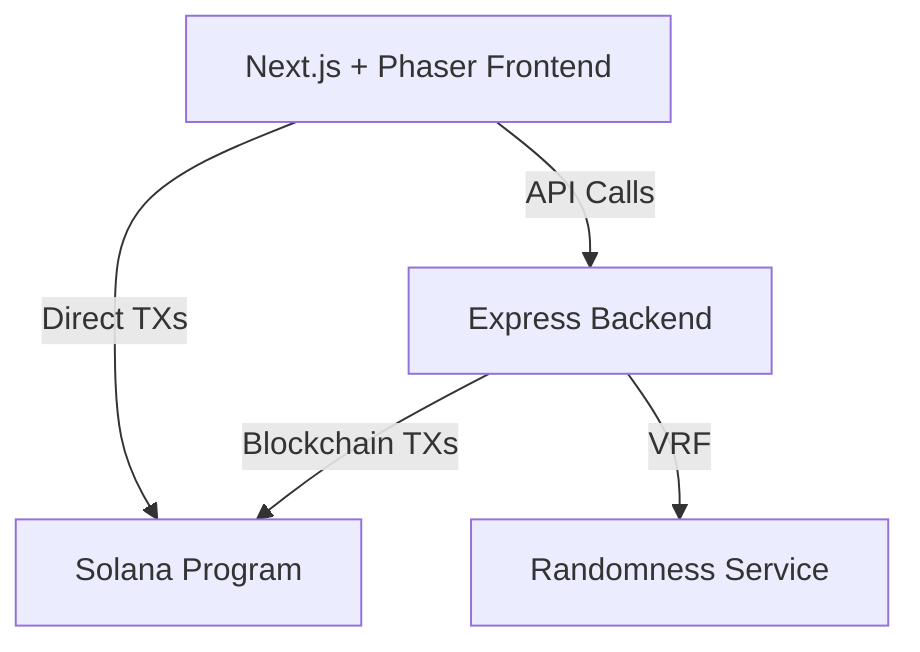
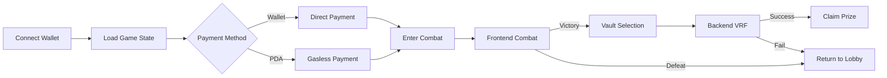

# Aurelius Arena Integration Guide

## Overview

Aurelius Arena is a blockchain-based gladiator game where players battle monsters for a chance to win the jackpot. The game uses a hybrid architecture with combat simulation on the frontend and blockchain interactions handled by the backend.

## Architecture



### Key Components

1. **Frontend**: Next.js + React + Phaser 3 + TypeScript
   - Combat simulation and gameplay
   - Wallet integration
   - Real-time state polling

2. **Backend**: Express.js + TypeScript + Anchor
   - Blockchain interactions
   - VRF for vault crack attempts
   - State management

3. **Smart Contract**: Anchor Framework
   - Program ID: `J18DRpsrSncmgAqbjVXdfF5qUdBpXJZZYPqRWY3pyV8z`
   - Entry fee collection, pot management, prize distribution

## Integration Flow



## Environment Setup

### Frontend (.env.local)
```env
NEXT_PUBLIC_API_URL=http://localhost:3001
NEXT_PUBLIC_PROGRAM_ID=J18DRpsrSncmgAqbjVXdfF5qUdBpXJZZYPqRWY3pyV8z
NEXT_PUBLIC_SOLANA_RPC=https://api.devnet.solana.com
NEXT_PUBLIC_SOLANA_NETWORK=devnet
NEXT_PUBLIC_ENTRY_FEE=0.01
```

### Backend (.env)
```env
PORT=3001
NODE_ENV=development
SOLANA_RPC_URL=https://api.devnet.solana.com
PROGRAM_ID=J18DRpsrSncmgAqbjVXdfF5qUdBpXJZZYPqRWY3pyV8z
TREASURY_ADDRESS=EsRy4vmaHbnj3kfj2X9rpRRgbKcA6a9DtdXrBddnNoVi
BACKEND_SIGNER=your_backend_wallet_private_key_here
ALLOWED_ORIGINS=http://localhost:3000,http://localhost:3001
```

## Key Integration Points

### 1. Game State Polling

Frontend polls backend every 2 seconds for current game state:

```typescript
// Frontend
const gameState = await fetch('/api/state');
// Returns: pot amount, current monster, recent combats
```

See [API Reference](./API_REFERENCE.md) for all endpoints.

### 2. Monster Synchronization

**Important**: Monsters are selected by the backend based on pot size.

- Frontend should NOT specify which monster to display
- Backend returns appropriate monster based on pot thresholds
- Frontend displays whatever monster backend sends

See [Monster Sync Guide](./MONSTER_SYNC.md) for details.

### 3. Payment Methods

Players can choose between two payment methods:

1. **Wallet Payment**: Direct transaction requiring approval
2. **PDA Payment**: Gasless after initial deposit (Note: PDA implementation is not yet fully tested)

Key differences:
- Wallet: User signs each transaction
- PDA: Backend pays fees, instant entry

See [Code Examples](./code-examples/transaction-flows.tsx) for implementation.

### 4. Combat Flow

1. Player clicks "Enter Battle" → Payment processed
2. Frontend runs combat simulation (no backend calls)
3. Victory → Show 3 vaults → Player selects one
4. Backend performs VRF check → Determines if vault cracks
5. Success → Prize distributed on-chain

### 5. Vault Crack Mechanism

- Each monster has a crack percentage (20-90%)
- Backend uses VRF to generate random number
- If random < threshold, vault cracks and player wins pot
- All three vaults have same probability

## Quick Start

### 1. Install Dependencies

```bash
# Frontend
cd web
npm install

# Backend  
cd backend
npm install
```

### 2. Start Services

```bash
# Terminal 1: Backend
cd backend
npm run dev

# Terminal 2: Frontend
cd web
npm run dev
```

### 3. Test Connection

```bash
# Check backend health
curl http://localhost:3001/health

# Check game state
curl http://localhost:3001/state
```

## Common Patterns

### State Management
```typescript
// Use polling hook
const { gameState, playerData, paymentOptions } = useGameState();
```

### Error Handling
```typescript
try {
  const result = await GameService.attemptVaultCrack(...);
} catch (error) {
  if (error.message.includes('Network')) {
    // Handle network error
  }
}
```

### Transaction Building
```typescript
// See code-examples/transaction-flows.tsx for full examples
const transaction = new Transaction().add(instruction);
const signature = await sendTransaction(transaction, connection);
```

## Security Considerations

1. **Never expose private keys** in frontend code
2. **Validate all inputs** on backend
3. **Use environment variables** for sensitive data
4. **Implement rate limiting** for API endpoints
5. **Audit smart contract** before mainnet deployment

## Deployment Checklist

- [ ] Environment variables configured
- [ ] CORS settings updated for production
- [ ] SSL certificates configured
- [ ] Backend wallet funded
- [ ] Program deployed to correct network
- [ ] API endpoints secured
- [ ] Error logging configured

## Resources

- [API Reference](./API_REFERENCE.md) - All endpoints and responses
- [Monster Sync Guide](./MONSTER_SYNC.md) - Backend-frontend synchronization
- [Code Examples](./code-examples/) - Implementation references
- [Troubleshooting](./TROUBLESHOOTING.md) - Common issues and solutions

## Support

- Solana Documentation: https://docs.solana.com
- Anchor Framework: https://www.anchor-lang.com/
- Phaser 3 Docs: https://phaser.io/phaser3

---

_Last Updated: January 2025_