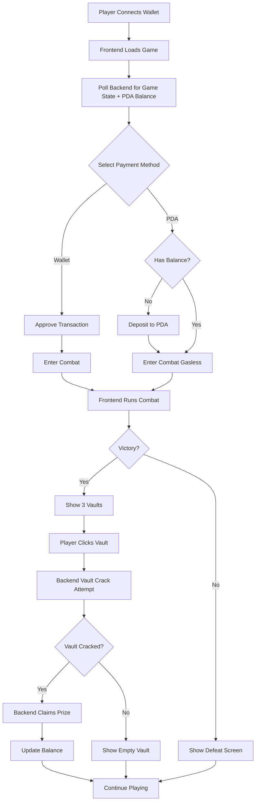

# Aurelius Arena Integration Guide

## Overview

This guide covers the complete integration between the Aurelius Arena frontend and backend systems. The game uses a hybrid architecture where combat runs on the frontend while the backend handles blockchain interactions and vault crack attempts.

## Architecture Components

### 1. Frontend (Next.js + Phaser)

- **Location**: `/web`
- **Tech Stack**: Next.js, React, Phaser 3, TypeScript
- **Responsibilities**:
  - Combat simulation and gameplay
  - Wallet integration
  - UI/UX for all game scenes
  - Real-time game state polling

### 2. Backend (Express + Solana)

- **Location**: `/backend`
- **Tech Stack**: Express.js, TypeScript, Anchor, Solana Web3.js
- **Responsibilities**:
  - Blockchain interactions
  - VRF (Verifiable Random Function) for vault cracks
  - Game state management
  - Prize distribution

### 3. Smart Contract (Anchor)

- **Location**: `/programs/aurelius`
- **Program ID**: `J18DRpsrSncmgAqbjVXdfF5qUdBpXJZZYPqRWY3pyV8z`
- **Network**: Solana Devnet
- **Responsibilities**:
  - Entry fee collection
  - Pot management
  - Prize distribution
  - Player account management

## Integration Flow



## Environment Configuration

### Frontend Environment (.env.local)

```env
# API Configuration
NEXT_PUBLIC_API_URL=http://localhost:3001

# Solana Configuration
NEXT_PUBLIC_PROGRAM_ID=J18DRpsrSncmgAqbjVXdfF5qUdBpXJZZYPqRWY3pyV8z
NEXT_PUBLIC_SOLANA_RPC=https://api.devnet.solana.com
NEXT_PUBLIC_SOLANA_NETWORK=devnet

# Game Configuration
NEXT_PUBLIC_ENTRY_FEE=0.01
NEXT_PUBLIC_POLLING_INTERVAL=2000
```

### Backend Environment (.env)

```env
# Server Configuration
PORT=3001
NODE_ENV=development

# Solana Configuration
SOLANA_RPC_URL=https://api.devnet.solana.com
PROGRAM_ID=J18DRpsrSncmgAqbjVXdfF5qUdBpXJZZYPqRWY3pyV8z
TREASURY_ADDRESS=EsRy4vmaHbnj3kfj2X9rpRRgbKcA6a9DtdXrBddnNoVi

# Backend Wallet (Base58 private key)
BACKEND_PRIVATE_KEY=your_backend_wallet_private_key_here

# CORS Configuration
ALLOWED_ORIGINS=http://localhost:3000,http://localhost:3001
```

## API Endpoints

### Core Endpoints

#### 1. Game State

```typescript
GET /state
Response: {
  currentPot: number,          // in lamports
  currentMonster: Monster,
  totalEntries: number,
  lastWinner: string | null,
  recentCombats: Combat[]
}
```

#### 2. Vault Crack Attempt

```typescript
POST /vault/attempt
Body: {
  wallet: string,
  combatId: string,
  monsterType: string
}
Response: {
  success: boolean,
  message: string,
  rollResult: number,
  threshold: number,
  prizeAmount?: number,
  txSignature?: string
}
```

#### 3. Player Stats

```typescript
GET /player/:walletAddress
Response: {
  wallet: string,
  balance: number,
  totalCombats: number,
  victories: number,
  totalWinnings: number,
  lastCombat: number,
  lastPaymentMethod: number
}
```

#### 4. Payment Options

```typescript
GET /player/:walletAddress/payment-options
Response: {
  hasAccount: boolean,
  pdaBalance: number,
  canUseWallet: boolean,
  canUsePDA: boolean,
  lastPaymentMethod: string
}
```

#### 5. Health Check

```typescript
GET /health
Response: {
  status: "ok",
  timestamp: string
}
```

#### 6. Gasless Combat Entry

```typescript
POST /combat/enter-gasless
Body: {
  playerWallet: string
}
Response: {
  success: boolean,
  txSignature: string,
  message: string
}
```

## Payment Method Selection

### Overview

Players can choose between two payment methods for entry fees:

- **Wallet Payment**: Direct SOL transfer from wallet (requires transaction approval)
- **PDA Payment**: Uses pre-deposited balance for gasless gameplay

### Lobby UI Components

#### 1. Payment Method Toggle

```typescript
// src/components/PaymentMethodToggle.tsx
import React from 'react';

interface PaymentMethodToggleProps {
  selectedMethod: 'wallet' | 'pda';
  onMethodChange: (method: 'wallet' | 'pda') => void;
  pdaBalance: number;
  entryFee: number;
}

export const PaymentMethodToggle: React.FC<PaymentMethodToggleProps> = ({
  selectedMethod,
  onMethodChange,
  pdaBalance,
  entryFee,
}) => {
  const canUsePDA = pdaBalance >= entryFee;

  return (
    <div className="payment-toggle-container">
      <div className="toggle-switch">
        <button
          className={`toggle-option ${
            selectedMethod === 'wallet' ? 'active' : ''
          }`}
          onClick={() => onMethodChange('wallet')}
        >
          <span>💳 Wallet Entry</span>
          <span className="subtitle">Pay from wallet</span>
        </button>
        <button
          className={`toggle-option ${
            selectedMethod === 'pda' ? 'active' : ''
          }`}
          onClick={() => onMethodChange('pda')}
          disabled={!canUsePDA}
        >
          <span>⚡ Gasless Entry</span>
          <span className="subtitle">Use PDA balance</span>
        </button>
      </div>
    </div>
  );
};
```

#### 2. PDA Balance Indicator

```typescript
// src/components/PDABalanceIndicator.tsx
import React, { useState } from 'react';
import { LAMPORTS_PER_SOL } from '@solana/web3.js';

interface PDABalanceIndicatorProps {
  pdaBalance: number;
  onDeposit: () => void;
  onWithdraw: () => void;
}

export const PDABalanceIndicator: React.FC<PDABalanceIndicatorProps> = ({
  pdaBalance,
  onDeposit,
  onWithdraw,
}) => {
  const balanceInSol = pdaBalance / LAMPORTS_PER_SOL;

  return (
    <div className="pda-balance-indicator">
      <div className="balance-display">
        <span className="label">PDA Balance:</span>
        <span className="amount">{balanceInSol.toFixed(4)} SOL</span>
      </div>
      <div className="balance-actions">
        <button className="deposit-btn" onClick={onDeposit}>
          + Deposit
        </button>
        <button
          className="withdraw-btn"
          onClick={onWithdraw}
          disabled={pdaBalance === 0}
        >
          - Withdraw
        </button>
      </div>
    </div>
  );
};
```

#### 3. Deposit/Withdraw Modals

```typescript
// src/components/PDADepositModal.tsx
import React, { useState } from 'react';
import { useWallet, useConnection } from '@solana/wallet-adapter-react';
import {
  Transaction,
  SystemProgram,
  PublicKey,
  LAMPORTS_PER_SOL,
} from '@solana/web3.js';

interface PDADepositModalProps {
  isOpen: boolean;
  onClose: () => void;
  onSuccess: () => void;
}

export const PDADepositModal: React.FC<PDADepositModalProps> = ({
  isOpen,
  onClose,
  onSuccess,
}) => {
  const [amount, setAmount] = useState('0.1');
  const [loading, setLoading] = useState(false);
  const { publicKey, sendTransaction } = useWallet();
  const { connection } = useConnection();

  const handleDeposit = async () => {
    if (!publicKey) return;

    try {
      setLoading(true);

      // Build deposit instruction
      const programId = new PublicKey(process.env.NEXT_PUBLIC_PROGRAM_ID!);
      const [playerPDA] = PublicKey.findProgramAddressSync(
        [Buffer.from('player'), publicKey.toBuffer()],
        programId
      );

      const depositIx = {
        programId,
        keys: [
          { pubkey: publicKey, isSigner: true, isWritable: true },
          { pubkey: playerPDA, isSigner: false, isWritable: true },
          {
            pubkey: SystemProgram.programId,
            isSigner: false,
            isWritable: false,
          },
        ],
        data: Buffer.concat([
          Buffer.from([
            /* deposit_to_pda discriminator */
          ]),
          Buffer.from(
            new BigUint64Array([BigInt(Number(amount) * LAMPORTS_PER_SOL)])
              .buffer
          ),
        ]),
      };

      const transaction = new Transaction().add(depositIx);
      const signature = await sendTransaction(transaction, connection);
      await connection.confirmTransaction(signature, 'confirmed');

      onSuccess();
      onClose();
    } catch (error) {
      console.error('Deposit failed:', error);
    } finally {
      setLoading(false);
    }
  };

  if (!isOpen) return null;

  return (
    <div className="modal-overlay">
      <div className="modal-content">
        <h2>Deposit to PDA</h2>
        <p>Deposit SOL for gasless gameplay</p>

        <input
          type="number"
          value={amount}
          onChange={(e) => setAmount(e.target.value)}
          min="0.01"
          step="0.01"
          placeholder="Amount in SOL"
        />

        <div className="modal-actions">
          <button onClick={onClose} disabled={loading}>
            Cancel
          </button>
          <button onClick={handleDeposit} disabled={loading || !amount}>
            {loading ? 'Depositing...' : 'Deposit'}
          </button>
        </div>
      </div>
    </div>
  );
};
```

### Integration with Game State

#### Update Game State Polling

```typescript
// src/hooks/useGameState.ts
export const useGameState = () => {
  const [gameState, setGameState] = useState<GameState | null>(null);
  const [playerData, setPlayerData] = useState<PlayerData | null>(null);
  const [paymentOptions, setPaymentOptions] = useState<PaymentOptions | null>(
    null
  );
  const { publicKey } = useWallet();

  useEffect(() => {
    const fetchData = async () => {
      // Fetch game state
      const state = await GameService.getColosseumState();
      setGameState(state);

      // Fetch player data and payment options if wallet connected
      if (publicKey) {
        const [player, options] = await Promise.all([
          GameService.getPlayerProfile(publicKey.toString()),
          GameService.getPaymentOptions(publicKey.toString()),
        ]);
        setPlayerData(player);
        setPaymentOptions(options);
      }
    };

    fetchData();
    const interval = setInterval(fetchData, 2000); // Poll every 2s

    return () => clearInterval(interval);
  }, [publicKey]);

  return { gameState, playerData, paymentOptions };
};
```

## Frontend Integration Points

### 1. GameService Configuration

```typescript
// src/services/GameService.ts
export class GameService {
  private static readonly BASE_URL = process.env.NEXT_PUBLIC_API_URL || '/api';

  // Vault crack attempt after combat victory
  static async attemptVaultCrack(
    wallet: string,
    combatId: string,
    monsterType: string
  ): Promise<VaultAttemptResponse> {
    const response = await fetch(`${this.BASE_URL}/vault/attempt`, {
      method: 'POST',
      headers: { 'Content-Type': 'application/json' },
      body: JSON.stringify({ wallet, combatId, monsterType }),
    });

    if (!response.ok) {
      throw new Error(`Vault attempt failed: ${response.status}`);
    }

    return response.json();
  }

  // Get payment options for a player
  static async getPaymentOptions(wallet: string): Promise<PaymentOptions> {
    const response = await fetch(
      `${this.BASE_URL}/player/${wallet}/payment-options`
    );

    if (!response.ok) {
      throw new Error(`Failed to fetch payment options: ${response.status}`);
    }

    return response.json();
  }
}
```

### 2. VaultScene Integration

```typescript
// src/game/scenes/VaultScene.ts
class VaultScene extends Phaser.Scene {
  private async handleVaultCrack() {
    try {
      // Get wallet and combat data
      const wallet = this.registry.get('walletAddress');
      const combatId = this.registry.get('currentCombatId');
      const monsterType = this.registry.get('defeatedMonster');

      // Call backend API
      const result = await GameService.attemptVaultCrack(
        wallet,
        combatId,
        monsterType
      );

      // Emit result to UI
      window.dispatchEvent(
        new CustomEvent('vault-result-display', {
          detail: {
            success: result.success,
            jackpotAmount: result.prizeAmount ? result.prizeAmount / 1e9 : 0,
          },
        })
      );
    } catch (error) {
      console.error('Vault crack attempt failed:', error);
      // Handle error appropriately
    }
  }
}
```

### 3. Combat Victory Flow

```typescript
// src/game/scenes/CombatScene.ts
private handleVictory() {
  // Store combat data for vault attempt
  this.registry.set('currentCombatId', GameService.generateCombatId());
  this.registry.set('defeatedMonster', this.currentMonster.name);

  // Transition to vault scene
  this.scene.start('VaultScene');
}
```

## Transaction Approval Flows

### Overview

The game supports two distinct transaction flows based on the selected payment method:

- **Wallet Payment Flow**: Requires user approval for each transaction
- **PDA Payment Flow**: Gasless after initial deposit (backend pays transaction fees)

### 1. Wallet Payment Flow

```typescript
// src/components/ColosseumScene/EnterBattle.tsx
import { useWallet, useConnection } from '@solana/wallet-adapter-react';
import { Transaction, PublicKey, SystemProgram } from '@solana/web3.js';
import { BN } from '@project-serum/anchor';

const EnterBattleWithWallet = () => {
  const { publicKey, sendTransaction } = useWallet();
  const { connection } = useConnection();
  const [loading, setLoading] = useState(false);

  const handleEnterBattle = async () => {
    if (!publicKey) return;

    try {
      setLoading(true);

      // Build enter_combat instruction
      const programId = new PublicKey(process.env.NEXT_PUBLIC_PROGRAM_ID!);
      const [gameStatePDA] = PublicKey.findProgramAddressSync(
        [Buffer.from('game_state')],
        programId
      );
      const [potVaultPDA] = PublicKey.findProgramAddressSync(
        [Buffer.from('pot_vault')],
        programId
      );
      const [playerPDA] = PublicKey.findProgramAddressSync(
        [Buffer.from('player'), publicKey.toBuffer()],
        programId
      );

      const enterCombatIx = {
        programId,
        keys: [
          { pubkey: publicKey, isSigner: true, isWritable: true },
          { pubkey: playerPDA, isSigner: false, isWritable: true },
          { pubkey: gameStatePDA, isSigner: false, isWritable: true },
          { pubkey: potVaultPDA, isSigner: false, isWritable: true },
          {
            pubkey: new PublicKey(
              'EsRy4vmaHbnj3kfj2X9rpRRgbKcA6a9DtdXrBddnNoVi'
            ), // treasury
            isSigner: false,
            isWritable: true,
          },
          {
            pubkey: SystemProgram.programId,
            isSigner: false,
            isWritable: false,
          },
        ],
        data: Buffer.from([
          /* enter_combat discriminator */
        ]),
      };

      const transaction = new Transaction().add(enterCombatIx);

      // User sees wallet popup here for approval
      const signature = await sendTransaction(transaction, connection);

      // Wait for confirmation
      await connection.confirmTransaction(signature, 'confirmed');

      // Transition to combat
      window.dispatchEvent(
        new CustomEvent('combat-entered', {
          detail: { paymentMethod: 'wallet', txSignature: signature },
        })
      );
    } catch (error: any) {
      if (error.message?.includes('User rejected')) {
        console.log('User cancelled transaction');
        // Stay in lobby, no side effects
      } else {
        console.error('Transaction failed:', error);
        // Show error to user
      }
    } finally {
      setLoading(false);
    }
  };

  return (
    <button
      onClick={handleEnterBattle}
      disabled={loading}
      className="enter-battle-btn"
    >
      {loading ? 'Awaiting approval...' : 'Enter Battle (0.01 SOL)'}
    </button>
  );
};
```

### 2. PDA Payment Flow (Gasless)

```typescript
// src/components/ColosseumScene/EnterBattleGasless.tsx
const EnterBattleGasless = () => {
  const { publicKey } = useWallet();
  const [loading, setLoading] = useState(false);

  const handleEnterBattle = async () => {
    if (!publicKey) return;

    try {
      setLoading(true);

      // No wallet popup - backend handles transaction
      const response = await fetch(
        `${process.env.NEXT_PUBLIC_API_URL}/combat/enter-gasless`,
        {
          method: 'POST',
          headers: { 'Content-Type': 'application/json' },
          body: JSON.stringify({ playerWallet: publicKey.toString() }),
        }
      );

      if (!response.ok) {
        const error = await response.json();
        if (error.error === 'Insufficient PDA balance') {
          // Prompt to deposit
          window.dispatchEvent(new CustomEvent('show-deposit-modal'));
          return;
        }
        throw new Error(error.error);
      }

      const result = await response.json();

      // Transition to combat immediately - no approval needed
      window.dispatchEvent(
        new CustomEvent('combat-entered', {
          detail: { paymentMethod: 'pda', txSignature: result.txSignature },
        })
      );
    } catch (error) {
      console.error('Gasless entry failed:', error);
    } finally {
      setLoading(false);
    }
  };

  return (
    <button
      onClick={handleEnterBattle}
      disabled={loading}
      className="enter-battle-btn gasless"
    >
      {loading ? 'Entering...' : '⚡ Enter Battle (Gasless)'}
    </button>
  );
};
```

### 3. Complete Lobby Integration

```typescript
// src/components/GameLobby.tsx
export const GameLobby = () => {
  const [paymentMethod, setPaymentMethod] = useState<'wallet' | 'pda'>(
    'wallet'
  );
  const [showDepositModal, setShowDepositModal] = useState(false);
  const [showWithdrawModal, setShowWithdrawModal] = useState(false);
  const { gameState, playerData, paymentOptions } = useGameState();

  // Listen for deposit prompt
  useEffect(() => {
    const handleDepositPrompt = () => setShowDepositModal(true);
    window.addEventListener('show-deposit-modal', handleDepositPrompt);
    return () =>
      window.removeEventListener('show-deposit-modal', handleDepositPrompt);
  }, []);

  return (
    <div className="game-lobby">
      {/* Payment Method Selection */}
      <PaymentMethodToggle
        selectedMethod={paymentMethod}
        onMethodChange={setPaymentMethod}
        pdaBalance={playerData?.balance || 0}
        entryFee={0.01 * LAMPORTS_PER_SOL}
      />

      {/* PDA Balance Display */}
      <PDABalanceIndicator
        pdaBalance={playerData?.balance || 0}
        onDeposit={() => setShowDepositModal(true)}
        onWithdraw={() => setShowWithdrawModal(true)}
      />

      {/* Enter Battle Button */}
      {paymentMethod === 'wallet' ? (
        <EnterBattleWithWallet />
      ) : (
        <EnterBattleGasless />
      )}

      {/* Modals */}
      <PDADepositModal
        isOpen={showDepositModal}
        onClose={() => setShowDepositModal(false)}
        onSuccess={() => {
          // Refresh payment options
          window.location.reload();
        }}
      />

      <PDAWithdrawModal
        isOpen={showWithdrawModal}
        onClose={() => setShowWithdrawModal(false)}
        onSuccess={() => {
          // Refresh payment options
          window.location.reload();
        }}
      />
    </div>
  );
};
```

### 4. Error Handling

```typescript
// src/utils/transactionErrors.ts
export const handleTransactionError = (error: any): string => {
  if (error.message?.includes('User rejected')) {
    return 'Transaction cancelled by user';
  }
  if (error.message?.includes('Insufficient funds')) {
    return 'Insufficient SOL balance';
  }
  if (error.message?.includes('0x1')) {
    return 'Insufficient PDA balance';
  }
  if (error.message?.includes('Blockhash not found')) {
    return 'Network error - please try again';
  }
  return 'Transaction failed - please try again';
};
```

## Backend Integration Points

### 1. VRF Service Setup

```typescript
// src/services/vrf-service.ts
export class VRFService {
  private connection: Connection;
  private programId: PublicKey;

  constructor() {
    this.connection = new Connection(process.env.SOLANA_RPC_URL!);
    this.programId = new PublicKey(process.env.PROGRAM_ID!);
  }

  async attemptVaultCrack(
    playerWallet: string,
    monsterType: string
  ): Promise<VaultCrackResult> {
    // VRF implementation
  }
}
```

### 2. Express Route Configuration

```typescript
// src/api/routes.ts
router.post('/vault/attempt', async (req, res) => {
  try {
    const { wallet, combatId, monsterType } = req.body;

    // Validate request
    if (!wallet || !combatId || !monsterType) {
      return res.status(400).json({ error: 'Missing required fields' });
    }

    // Process vault crack attempt
    const result = await vrfService.attemptVaultCrack(wallet, monsterType);

    res.json(result);
  } catch (error) {
    console.error('Vault attempt error:', error);
    res.status(500).json({ error: 'Internal server error' });
  }
});
```

## Testing the Integration

### 1. Start Backend Server

```bash
cd backend
npm install
npm run dev
```

### 2. Start Frontend Development Server

```bash
cd web
npm install
npm run dev
```

### 3. Test Health Check

```bash
curl http://localhost:3001/health
```

### 4. Test Game State Endpoint

```bash
curl http://localhost:3001/state
```

### 5. Manual Vault Crack Test

```bash
curl -X POST http://localhost:3001/vault/attempt \
  -H "Content-Type: application/json" \
  -d '{
    "wallet": "YOUR_WALLET_ADDRESS",
    "combatId": "test_combat_123",
    "monsterType": "Goblin"
  }'
```

## Common Integration Issues

### 1. CORS Errors

**Problem**: Frontend cannot connect to backend due to CORS
**Solution**: Ensure backend CORS middleware is configured:

```typescript
app.use(
  cors({
    origin: process.env.ALLOWED_ORIGINS?.split(',') || '*',
    credentials: true,
  })
);
```

### 2. Connection Refused

**Problem**: Frontend cannot reach backend API
**Solution**:

- Verify backend is running on correct port
- Check `NEXT_PUBLIC_API_URL` in frontend env
- Ensure no firewall blocking

### 3. Wallet Connection Issues

**Problem**: Wallet not connecting or transactions failing
**Solution**:

- Ensure using correct network (devnet)
- Check wallet adapter configuration
- Verify program ID matches

### 4. State Synchronization

**Problem**: Frontend state doesn't match blockchain state
**Solution**:

- Implement proper polling intervals
- Add error retry logic
- Cache invalidation on updates

## Vault Selection UI

### Overview

After defeating a monster, players are presented with three vault doors to choose from. Clicking any vault triggers the same VRF-based crack attempt with the defeated monster's probability.

### 1. VaultScene UI Implementation

```typescript
// src/game/scenes/VaultScene.ts
import { BaseScene } from './BaseScene';

export class VaultScene extends BaseScene {
  private vaults: Phaser.GameObjects.Sprite[] = [];
  private selectedVault: number | null = null;
  private isProcessing: boolean = false;

  protected createScene() {
    // Background
    this.add.image(
      this.scale.width / 2,
      this.scale.height / 2,
      'vault-background'
    );

    // Create three vault doors
    const vaultPositions = [
      { x: this.scale.width * 0.25, y: this.scale.height * 0.5 },
      { x: this.scale.width * 0.5, y: this.scale.height * 0.5 },
      { x: this.scale.width * 0.75, y: this.scale.height * 0.5 },
    ];

    vaultPositions.forEach((pos, index) => {
      const vault = this.add
        .sprite(pos.x, pos.y, 'vault-door')
        .setInteractive({ useHandCursor: true })
        .setScale(0.8);

      // Add hover effects
      vault.on('pointerover', () => {
        if (!this.isProcessing) {
          vault.setTint(0xffff00);
          this.tweens.add({
            targets: vault,
            scale: 0.85,
            duration: 200,
            ease: 'Power2',
          });
        }
      });

      vault.on('pointerout', () => {
        if (!this.isProcessing) {
          vault.clearTint();
          this.tweens.add({
            targets: vault,
            scale: 0.8,
            duration: 200,
            ease: 'Power2',
          });
        }
      });

      // Click handler
      vault.on('pointerdown', () => this.handleVaultClick(index));

      this.vaults.push(vault);
    });

    // Instructions text
    this.add
      .text(
        this.scale.width / 2,
        this.scale.height * 0.2,
        'Choose a vault to crack!',
        {
          fontSize: '32px',
          color: '#ffffff',
          stroke: '#000000',
          strokeThickness: 4,
        }
      )
      .setOrigin(0.5);

    // Emit scene ready event
    window.dispatchEvent(new CustomEvent('vaultSceneReady'));
  }

  private async handleVaultClick(vaultIndex: number) {
    if (this.isProcessing || this.selectedVault !== null) return;

    this.selectedVault = vaultIndex;
    this.isProcessing = true;

    // Disable all vaults
    this.vaults.forEach((vault) => vault.disableInteractive());

    // Visual feedback
    const selectedVault = this.vaults[vaultIndex];
    this.add
      .text(selectedVault.x, selectedVault.y - 100, 'Attempting...', {
        fontSize: '24px',
        color: '#ffff00',
      })
      .setOrigin(0.5);

    // Play vault selection animation
    this.tweens.add({
      targets: selectedVault,
      scale: 0.9,
      duration: 300,
      yoyo: true,
      repeat: 2,
      onComplete: () => {
        this.attemptVaultCrack(vaultIndex);
      },
    });
  }

  private async attemptVaultCrack(vaultIndex: number) {
    try {
      // Get stored combat data
      const wallet = this.registry.get('walletAddress');
      const combatId = this.registry.get('currentCombatId');
      const monsterType = this.registry.get('defeatedMonster');

      // Call backend API
      const result = await GameService.attemptVaultCrack(
        wallet,
        combatId,
        monsterType
      );

      // Show result
      if (result.success) {
        this.showVaultSuccess(vaultIndex, result.prizeAmount);
      } else {
        this.showVaultFailure(vaultIndex, result.rollResult, result.threshold);
      }

      // Emit result event for React UI
      window.dispatchEvent(
        new CustomEvent('vault-result', {
          detail: {
            vaultIndex,
            success: result.success,
            roll: result.rollResult,
            threshold: result.threshold,
            prizeAmount: result.prizeAmount,
          },
        })
      );
    } catch (error) {
      console.error('Vault crack attempt failed:', error);
      this.showError();
    }
  }

  private showVaultSuccess(vaultIndex: number, prizeAmount: number) {
    const vault = this.vaults[vaultIndex];

    // Open vault animation
    vault.play('vault-open-animation');

    // Show prize
    const prizeInSol = prizeAmount / 1e9;
    const prizeText = this.add
      .text(vault.x, vault.y, `🎉 ${prizeInSol.toFixed(4)} SOL! 🎉`, {
        fontSize: '36px',
        color: '#00ff00',
        stroke: '#000000',
        strokeThickness: 6,
      })
      .setOrigin(0.5);

    // Particle effects
    const particles = this.add.particles(vault.x, vault.y, 'gold-particle', {
      speed: { min: 200, max: 400 },
      scale: { start: 1, end: 0 },
      blendMode: 'ADD',
      lifespan: 1000,
      quantity: 50,
    });

    // Transition after delay
    this.time.delayedCall(3000, () => {
      this.scene.start('ColosseumScene');
    });
  }

  private showVaultFailure(
    vaultIndex: number,
    roll: number,
    threshold: number
  ) {
    const vault = this.vaults[vaultIndex];

    // Shake vault
    this.cameras.main.shake(300, 0.02);

    // Show failure message
    const failText = this.add
      .text(
        vault.x,
        vault.y - 50,
        `Failed! Roll: ${roll} (needed < ${threshold})`,
        {
          fontSize: '24px',
          color: '#ff0000',
          stroke: '#000000',
          strokeThickness: 4,
        }
      )
      .setOrigin(0.5);

    // Red flash on vault
    vault.setTint(0xff0000);
    this.time.delayedCall(300, () => vault.clearTint());

    // Return to colosseum after delay
    this.time.delayedCall(2500, () => {
      this.scene.start('ColosseumScene');
    });
  }

  private showError() {
    this.add
      .text(
        this.scale.width / 2,
        this.scale.height * 0.7,
        'Error occurred. Please try again.',
        {
          fontSize: '24px',
          color: '#ff0000',
        }
      )
      .setOrigin(0.5);

    this.time.delayedCall(2000, () => {
      this.scene.start('ColosseumScene');
    });
  }
}
```

### 2. React UI Integration

```typescript
// src/components/VaultSceneUI.tsx
import React, { useEffect, useState } from 'react';
import { useWallet } from '@solana/wallet-adapter-react';

interface VaultResult {
  vaultIndex: number;
  success: boolean;
  roll: number;
  threshold: number;
  prizeAmount?: number;
}

export const VaultSceneUI: React.FC = () => {
  const [result, setResult] = useState<VaultResult | null>(null);
  const [monsterInfo, setMonsterInfo] = useState<any>(null);
  const { publicKey } = useWallet();

  useEffect(() => {
    // Get monster info from Phaser registry
    const handleSceneReady = () => {
      const game = (window as any).game;
      if (game) {
        const monster = game.registry.get('defeatedMonster');
        const monsterData = game.registry.get('monsterData');
        setMonsterInfo({
          name: monster,
          crackChance: monsterData?.vaultCrackChance || 0,
        });
      }
    };

    // Listen for vault result
    const handleVaultResult = (event: CustomEvent) => {
      setResult(event.detail);
    };

    window.addEventListener('vaultSceneReady', handleSceneReady);
    window.addEventListener('vault-result', handleVaultResult as EventListener);

    return () => {
      window.removeEventListener('vaultSceneReady', handleSceneReady);
      window.removeEventListener(
        'vault-result',
        handleVaultResult as EventListener
      );
    };
  }, []);

  return (
    <div className="vault-scene-ui">
      {/* Monster Info */}
      {monsterInfo && (
        <div className="monster-info-panel">
          <h3>Defeated: {monsterInfo.name}</h3>
          <p>Vault Crack Chance: {monsterInfo.crackChance}%</p>
        </div>
      )}

      {/* Result Display */}
      {result && (
        <div
          className={`vault-result ${result.success ? 'success' : 'failure'}`}
        >
          {result.success ? (
            <>
              <h2>🎉 Vault Cracked! 🎉</h2>
              <p className="prize-amount">
                Won: {(result.prizeAmount! / 1e9).toFixed(4)} SOL
              </p>
            </>
          ) : (
            <>
              <h2>Vault Resisted</h2>
              <p>Your roll: {result.roll}</p>
              <p>Needed: Less than {result.threshold}</p>
            </>
          )}
        </div>
      )}

      {/* Instructions */}
      {!result && (
        <div className="vault-instructions">
          <p>Click any vault to attempt cracking!</p>
          <p>All vaults have the same {monsterInfo?.crackChance}% chance</p>
        </div>
      )}
    </div>
  );
};
```

### 3. Styling

```css
/* src/styles/vault-scene.css */
.vault-scene-ui {
  position: absolute;
  top: 0;
  left: 0;
  right: 0;
  padding: 20px;
  pointer-events: none;
}

.monster-info-panel {
  background: rgba(0, 0, 0, 0.8);
  border: 2px solid #gold;
  border-radius: 10px;
  padding: 15px;
  max-width: 300px;
  color: white;
}

.vault-instructions {
  position: absolute;
  bottom: 50px;
  left: 50%;
  transform: translateX(-50%);
  text-align: center;
  color: white;
  text-shadow: 2px 2px 4px rgba(0, 0, 0, 0.8);
}

.vault-result {
  position: absolute;
  top: 50%;
  left: 50%;
  transform: translate(-50%, -50%);
  background: rgba(0, 0, 0, 0.9);
  border-radius: 20px;
  padding: 40px;
  text-align: center;
  animation: fadeIn 0.5s;
}

.vault-result.success {
  border: 3px solid #00ff00;
  box-shadow: 0 0 30px #00ff00;
}

.vault-result.failure {
  border: 3px solid #ff0000;
  box-shadow: 0 0 30px #ff0000;
}

.prize-amount {
  font-size: 36px;
  color: #00ff00;
  font-weight: bold;
  margin: 20px 0;
}

@keyframes fadeIn {
  from {
    opacity: 0;
    transform: translate(-50%, -50%) scale(0.8);
  }
  to {
    opacity: 1;
    transform: translate(-50%, -50%) scale(1);
  }
}
```

### 4. Integration with Game Flow

```typescript
// Update CombatScene victory handler
// src/game/scenes/CombatScene.ts
private handleVictory() {
  // Store combat data for vault attempt
  this.registry.set('currentCombatId', GameService.generateCombatId());
  this.registry.set('defeatedMonster', this.currentMonster.name);
  this.registry.set('monsterData', this.currentMonster);

  // Show victory message
  this.showVictoryMessage();

  // Transition to vault scene after delay
  this.time.delayedCall(2000, () => {
    this.scene.start('VaultScene');
  });
}
```

## Security Considerations

1. **API Authentication**: Consider adding JWT or API key authentication
2. **Rate Limiting**: Implement rate limiting on vault crack attempts
3. **Input Validation**: Validate all inputs on backend
4. **Environment Variables**: Never commit sensitive keys
5. **HTTPS**: Use HTTPS in production

## Deployment Checklist

- [ ] Environment variables configured for production
- [ ] CORS settings updated for production domains
- [ ] SSL certificates configured
- [ ] Backend wallet funded
- [ ] Program deployed to mainnet (if applicable)
- [ ] API endpoints secured
- [ ] Error logging configured
- [ ] Monitoring setup
- [ ] Load testing completed
- [ ] Security audit performed

## Next Steps

1. **Implement WebSocket**: For real-time updates instead of polling
2. **Add Caching**: Redis for game state caching
3. **Queue System**: For handling high-volume vault attempts
4. **Analytics**: Track game metrics and player behavior
5. **Backup Systems**: Implement failover mechanisms

## Support Resources

- [Solana Documentation](https://docs.solana.com)
- [Anchor Framework](https://www.anchor-lang.com/)
- [Next.js Documentation](https://nextjs.org/docs)
- [Phaser 3 Documentation](https://phaser.io/phaser3)

---

_Last Updated: December 2024_
