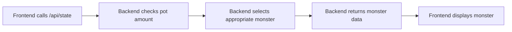

# Monster Synchronization Guide

## Overview

Monsters in Aurelius Arena are automatically selected by the backend based on the current pot size. This ensures game difficulty scales with the potential prize amount.

## How It Works

### 1. Automatic Monster Selection

The backend determines which monster to spawn based on pot thresholds:

```
Pot Size         → Monster Tier
0-0.02 SOL       → Skeleton Warrior (90% crack chance)
0.02-0.04 SOL    → Goblin Archer (25% crack chance)  
0.04-0.06 SOL    → Orc Gladiator (20% crack chance)
0.06-0.08 SOL    → Minotaur Champion (70% crack chance)
0.08+ SOL        → Cyclops Titan (80% crack chance)
```

### 2. Frontend-Backend Flow



**Important:** The frontend should NOT send a monster parameter to the backend. The backend automatically selects the appropriate monster based on the current pot size.

### 3. Implementation

#### Frontend (ColosseumScene.ts)

```typescript
private async loadGameState() {
  try {
    // DO NOT send monster parameter in production
    const url = new URL('/api/state', window.location.origin);
    
    // Only in dev mode: allow manual monster selection
    if (this.devMode && this.selectedMonster) {
      url.searchParams.set('monster', this.selectedMonster);
    }
    
    const response = await fetch(url.toString());
    if (!response.ok) {
      throw new Error(`HTTP ${response.status}`);
    }
    
    this.colosseumState = await response.json();
    
    // Display whatever monster the backend returns
    this.updateMonsterDisplay();
    
  } catch (error) {
    console.error('Failed to load game state:', error);
    this.showOfflineState();
  }
}

private updateMonsterDisplay() {
  if (!this.colosseumState?.currentMonster) return;
  
  const monster = this.colosseumState.currentMonster;
  
  // Update sprite using the backend's chosen monster
  const spriteKey = monster.tier.sprite;
  if (this.textures.exists(spriteKey)) {
    this.monsterSprite.setTexture(spriteKey);
  } else {
    console.error(`Monster sprite not found: ${spriteKey}`);
    // Use fallback sprite
    this.monsterSprite.setTexture('skeleton_warrior');
  }
}
```

#### Backend (state endpoint)

```typescript
app.get('/api/state', async (req, res) => {
  try {
    // Get current pot amount from blockchain
    const potAmount = await getPotBalance();
    
    // Let backend decide monster based on pot
    // ONLY use query param in dev mode
    let selectedMonster;
    if (process.env.NODE_ENV === 'development' && req.query.monster) {
      selectedMonster = getMonsterByType(req.query.monster);
    } else {
      selectedMonster = selectMonsterByPotAmount(potAmount);
    }
    
    res.json({
      currentPot: potAmount,
      currentMonster: selectedMonster,
      totalEntries: await getTotalEntries(),
      lastWinner: await getLastWinner(),
      recentCombats: await getRecentCombats()
    });
  } catch (error) {
    console.error('State fetch error:', error);
    res.status(500).json({ error: 'Failed to fetch game state' });
  }
});

function selectMonsterByPotAmount(potInLamports: number): Monster {
  const potInSol = potInLamports / LAMPORTS_PER_SOL;
  
  if (potInSol >= 0.08) return MONSTERS.CYCLOPS_TITAN;
  if (potInSol >= 0.06) return MONSTERS.MINOTAUR_CHAMPION;
  if (potInSol >= 0.04) return MONSTERS.ORC_GLADIATOR;
  if (potInSol >= 0.02) return MONSTERS.GOBLIN_ARCHER;
  return MONSTERS.SKELETON_WARRIOR;
}
```

## Common Issues and Solutions

### 1. Monster Sprite Not Showing

**Problem:** Backend returns a monster but the sprite doesn't appear in the game.

**Possible Causes:**
- Sprite key mismatch between backend and frontend
- Sprite not loaded in Preloader scene
- Texture loading race condition

**Solution:**
```typescript
// In Preloader scene, ensure all monster sprites are loaded
preload() {
  // Load all monster sprites
  this.load.image('skeleton-placeholder', 'assets/sprites/skeleton_warrior.png');
  this.load.image('goblin-placeholder', 'assets/sprites/goblin_archer.png');
  this.load.image('orc-placeholder', 'assets/sprites/orc_gladiator.png');
  this.load.image('minotaur-placeholder', 'assets/sprites/minotaur_champion.png');
  this.load.image('cyclops-placeholder', 'assets/sprites/cyclops_titan.png');
}

// Add fallback in monster display
if (this.textures.exists(spriteKey)) {
  this.monsterSprite.setTexture(spriteKey);
} else {
  console.error(`Missing sprite: ${spriteKey}, using fallback`);
  this.monsterSprite.setTexture('skeleton-placeholder'); // fallback
}
```

### 2. Wrong Monster Tier Appearing

**Problem:** The displayed monster doesn't match the expected pot threshold.

**Possible Causes:**
- Frontend sending monster parameter when it shouldn't
- Backend threshold configuration incorrect
- Cached state data

**Solution:**
- Remove any `monster` query parameters from production code
- Verify backend threshold configuration
- Clear cache and force refresh: `Cache-Control: no-cache`

### 3. Dev Mode Not Working

**Problem:** Can't manually select monsters in development.

**Solution:**
```typescript
// Ensure dev mode is properly toggled
private devMode: boolean = process.env.NODE_ENV === 'development';

// Only send monster param in dev mode
if (this.devMode && this.selectedMonster) {
  url.searchParams.set('monster', this.selectedMonster);
}
```

## Testing Monster Sync

### 1. Manual Testing

```bash
# Test different pot amounts
curl http://localhost:3001/api/state

# Dev mode: Force specific monster
curl "http://localhost:3001/api/state?monster=Cyclops%20Titan"
```

### 2. Automated Tests

```typescript
describe('Monster Selection', () => {
  it('should return Skeleton Warrior for small pot', async () => {
    mockPotBalance(0.01 * LAMPORTS_PER_SOL);
    const state = await getGameState();
    expect(state.currentMonster.type).toBe('Skeleton Warrior');
  });
  
  it('should return Cyclops Titan for large pot', async () => {
    mockPotBalance(0.1 * LAMPORTS_PER_SOL);
    const state = await getGameState();
    expect(state.currentMonster.type).toBe('Cyclops Titan');
  });
});
```

## Best Practices

1. **Never hardcode monsters** in production frontend code
2. **Always trust backend** for monster selection
3. **Implement sprite fallbacks** to handle missing assets
4. **Log sprite loading errors** for debugging
5. **Test all pot thresholds** when adding new monsters
6. **Keep monster data synchronized** between frontend and backend configs

## Future Improvements

1. **Dynamic asset loading**: Load monster sprites on-demand based on backend response
2. **Monster preview**: Show next tier threshold in UI
3. **Special event monsters**: Time-based or event-based monster spawns
4. **Progressive difficulty**: Adjust monster stats within tiers based on pot size